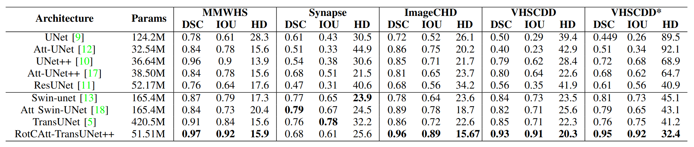
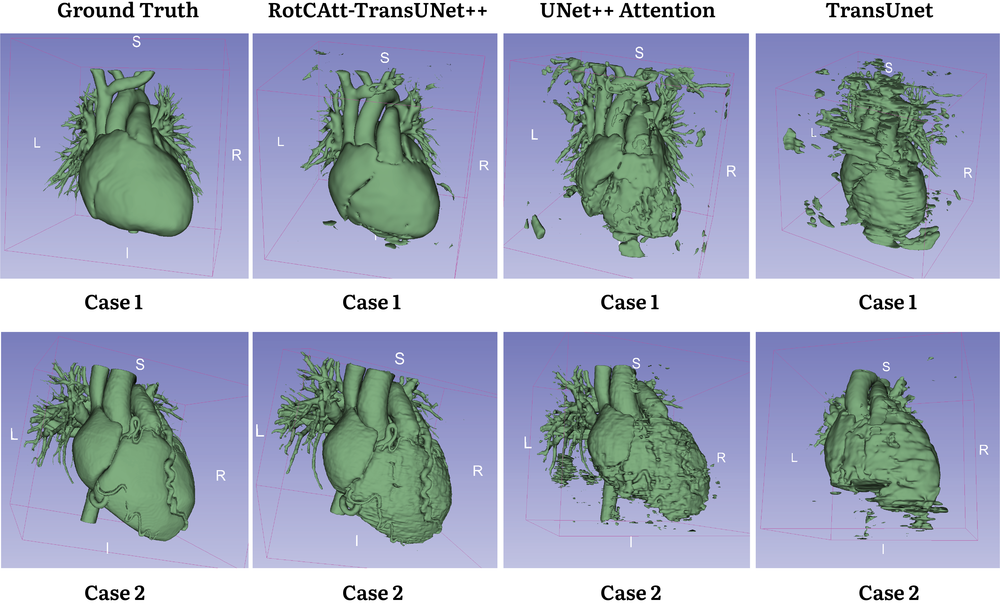
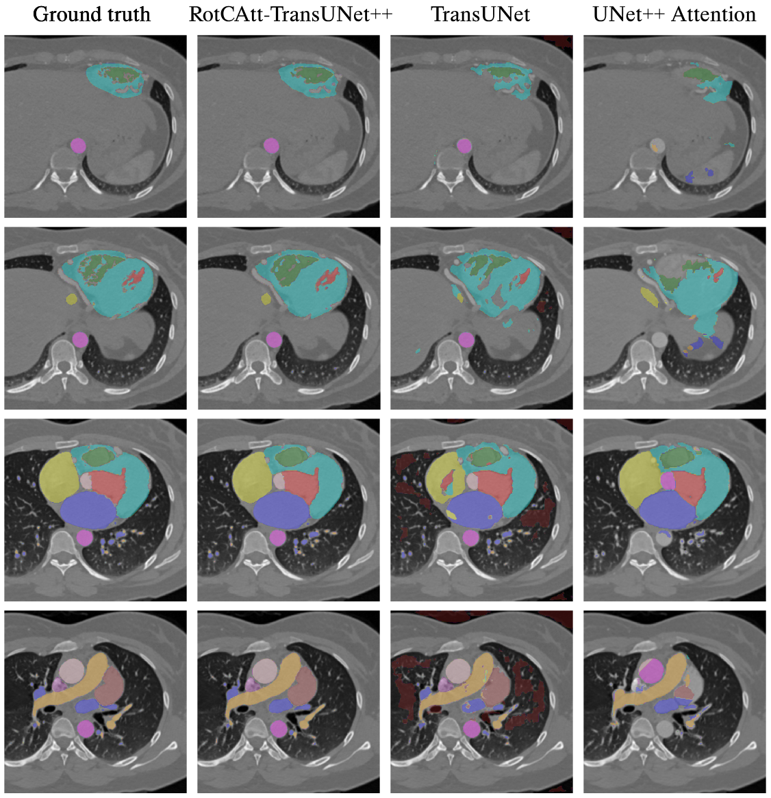

# RotCAtt-TransUNet++: Novel Deep Neural Network for Cardiac Segmentation

## MAPR 2024
[](https://ieeexplore.ieee.org/document/10660759/)
[](https://arxiv.org/abs/2409.05280)

## Presentation
[](https://www.facebook.com/share/v/2p6YfjM4RaPLVbJM/)
[](https://drive.google.com/file/d/11xyR8JpEheDu_ReHQwDMSGWLa5kjKcmQ/view?usp=sharing)
[](https://drive.google.com/file/d/1Y3TW2CqJSxAwb3eiyyiyDMSdvlZkiiGr/view?usp=sharing)
[](https://paperswithcode.com/paper/rotcatt-transunet-novel-deep-neural-network)


## Abstract
Cardiovascular disease is a major global health concern, contributing significantly to global mortality. Accurately segmenting cardiac medical imaging data is crucial for reducing fatality rates associated with these conditions. However, current state-of-the-art (SOTA) neural networks, including CNN-based and Transformer-based approaches, face challenges in capturing both inter-slice connections and intra-slice details, especially in datasets featuring intricate, long-range details along the z-axis like coronary arteries. Existing methods also struggle with differentiating non-cardiac components from the myocardium, resulting in segmentation inaccuracies and the "spraying" phenomenon. To address these issues, we introduce RotCAtt-TransUNet++, a novel architecture designed for robust segmentation of intricate cardiac structures. Our approach enhances global context mod-eling through multiscale feature aggregation and nested skip connections in the encoder. Transformer layers facilitate capturing intra-slice interactions, while a rotatory attention mechanism handles inter-slice connectivity. A channel-wise cross-attention gate integrates multiscale information and decoder features, effectively bridging semantic gaps. Experimental results across multiple datasets demonstrate superior performance over current methods, achieving near-perfect annotation of coronary arteries and myocardium. Ablation studies confirm that our rotatory attention mechanism significantly improves segmentation accuracy by transforming embedded vectorized patches in semantic dimensional space.

## Result
Benchmark 9 models across 4 medical datasets. Our model's lightweight nature is due to having only four transformer layers. The robustness of rotatory attention allows encoded vectorized patches to be effectively transformed in the semantic space, reducing the need for numerous transformer layers. Our network demonstrates the fastest convergence time when applied to cardiac data, thanks to robust long-range interslice connectivity.



**Comparison with state-of-the-arts**:
Our model achieves near-perfect accuracy and produces high-quality refined segmentation mask and 3D reconstruction.
|     |  |
| -------- | ------- |
|  |  |


## Build for training
Install Pytorch in conda or use this docker image:
```
docker pull kylepaul/deeplearning:deployment
```
Setup the dataset and make sure to process the data into this structures. All dataset can be downloaded here.
```
<dataset name>
    ├── p_images
    |   ├── 0001_0001.npy
    │   ├── 0001_0002.npy
    │   ├── 0001_0003.npy
    │   ├── ...
    |
    └── p_labels
        ├── 0001_0001.npy
        ├── 0001_0002.npy
        ├── 0001_0003.npy
        ├── ...   
```
Then start training
```
python train.py
```

## Citation
```
@INPROCEEDINGS{10660759,
    author={Nguyen-Le, Quoc-Bao and Le, Tuan-Hy and Do, Anh-Triet and Trinh, Quoc-Huy},
    booktitle={2024 International Conference on Multimedia Analysis and Pattern Recognition (MAPR)}, 
    title={RotCAtt-TransUNet++: Novel Deep Neural Network for Sophisticated Cardiac Segmentation}, 
    year={2024},
    volume={},
    number={},
    pages={1-6},
    keywords={Image segmentation;Attention mechanisms;Face recognition;Semantics;Spraying;Myocardium;Logic gates},
    doi={10.1109/MAPR63514.2024.10660759}}
```